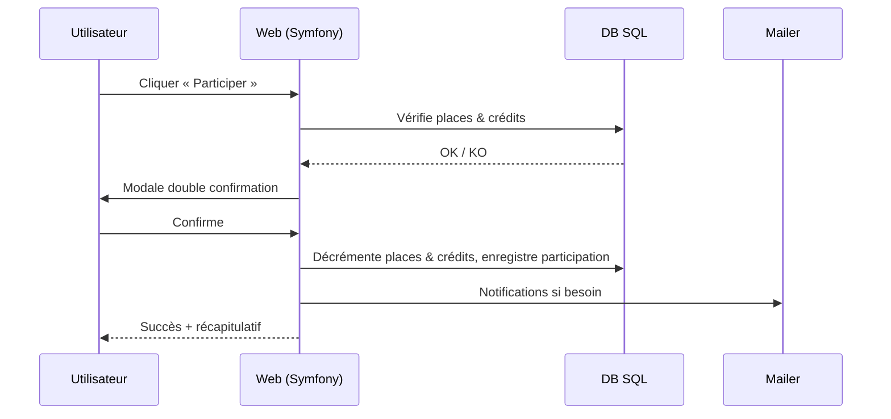
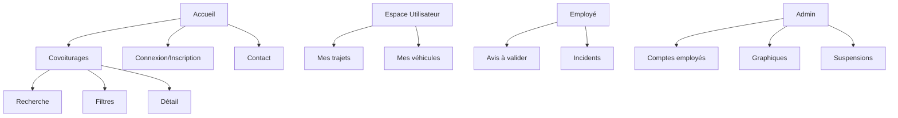
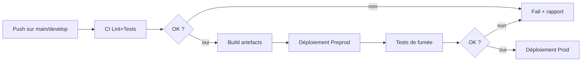
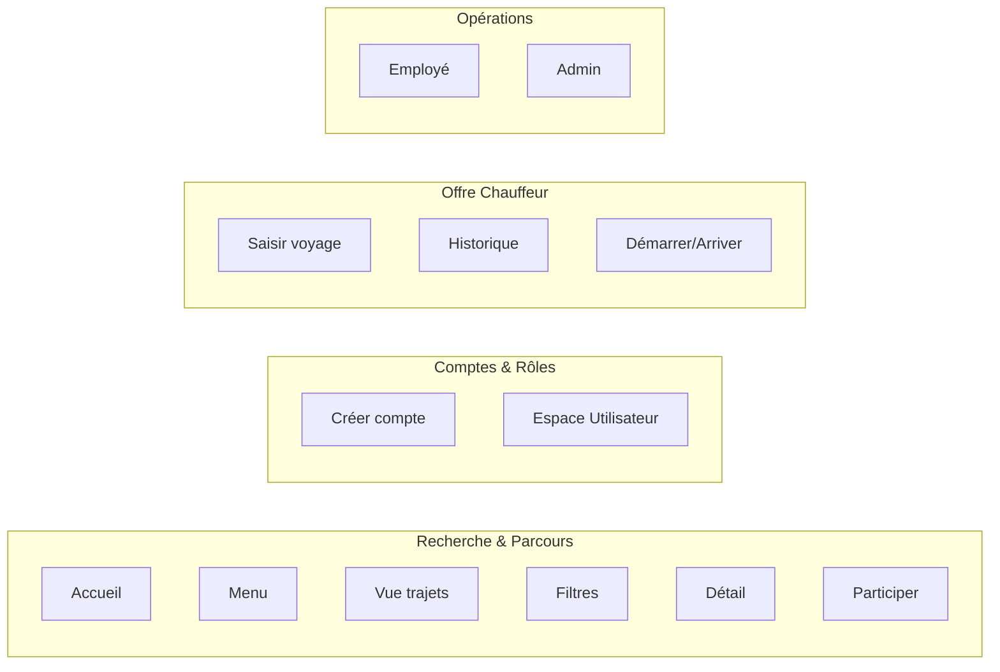
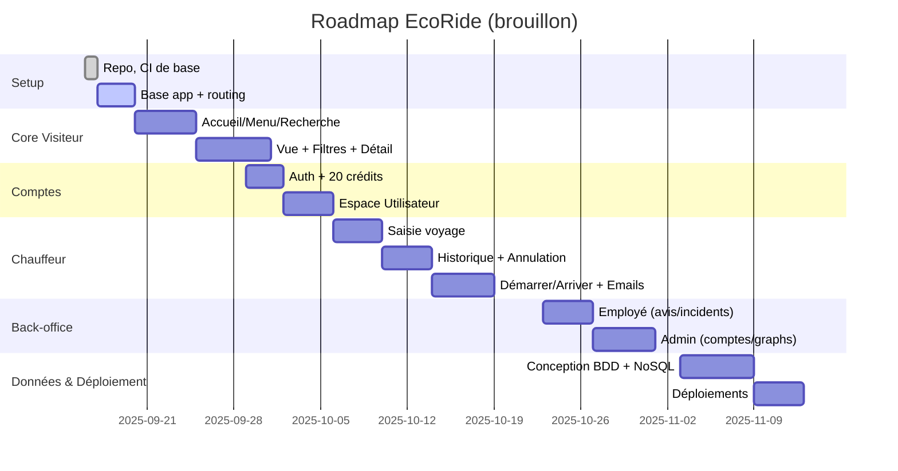
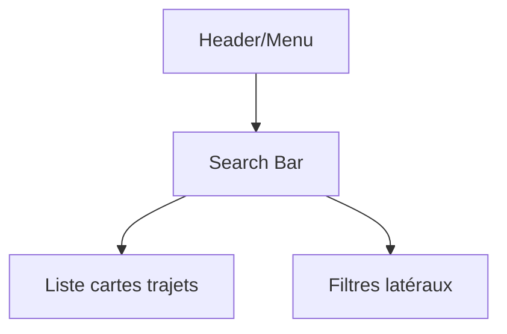
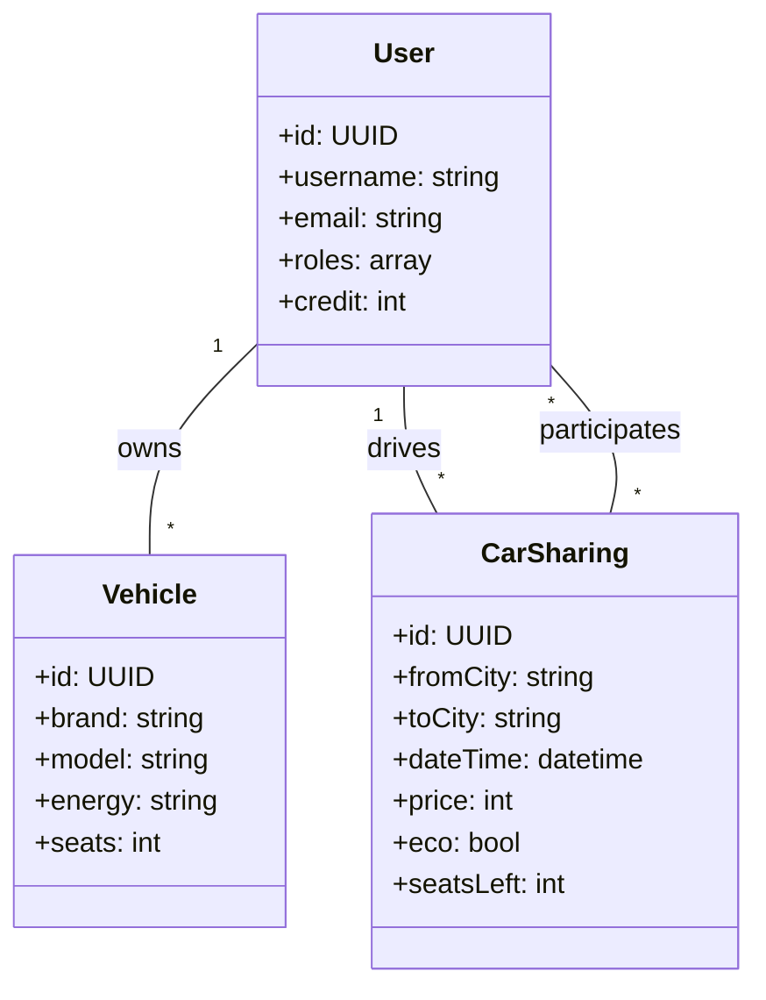

# EcoRide — Plateforme de covoiturage écoresponsable

> **TP DWWM — Projet complet front + back**  
> Objectif : concevoir, développer et déployer une application web sécurisée favorisant le covoiturage en voiture, avec une identité visuelle « green ».  
> _NB : la conception **BDD relationnelle & NoSQL** sera réalisée dans une itération dédiée — **ne pas utiliser le schéma fourni en annexe**. Les sections “Données” de ce README sont donc préparées pour accueillir notre **modèle maison** ultérieurement._

---

## 📚 Sommaire
- [Vision & pitch](#-vision--pitch)
- [Périmètre fonctionnel (US1 → US13)](#-périmètre-fonctionnel-us1--us13)
- [Architecture & choix techniques](#-architecture--choix-techniques)
- [Démarrage rapide (dev local)](#-démarrage-rapide-dev-local)
- [Qualité, sécurité & conformité](#-qualité-sécurité--conformité)
- [Conception données (placeholder)](#-conception-données-placeholder)
- [UX/UI & identité](#-uxui--identité)
- [Déploiement & CI/CD](#-déploiement--cicd)
- [Plan de projet & Kanban](#-plan-de-projet--kanban)
- [Annexes (Mermaid)](#-annexes-mermaid)

---

## 🌿 Vision & pitch
**EcoRide** facilite le **covoiturage en voiture** en mettant l’accent sur l’écologie, l’économie et la simplicité d’usage. Les trajets **électriques** sont mis en avant (badge « éco »), les utilisateurs gèrent leurs rôles (chauffeur / passager), leurs véhicules, leurs préférences, et participent aux trajets via un système de **crédits**.

**Objectifs clés**
- Expérience claire pour **rechercher / filtrer / participer** à des trajets.
- **Back-office** pour employés (validation d’avis, incidents) et **administration** (comptes, graphiques, suspensions).
- **Déploiement** reproductible + **documentation** du setup local & cloud.

---

## 🧭 Périmètre fonctionnel (US1 → US13)

| # | Titre | Rôle principal | Résumé |
|---:|---|---|---|
| US1 | Page d’accueil | Visiteur | Présentation, barre de recherche, footer (contact + mentions légales). |
| US2 | Menu | Visiteur | Accès Accueil, Covoiturages, Connexion, Contact. |
| US3 | Vue des covoiturages | Visiteur | Formulaire (ville départ, arrivée, date). Affichage : conducteur (pseudo, photo, note), places restantes, prix, départ/arrivée, badge « éco », bouton « détail ». Proposition de **date la plus proche** s’il n’y a pas de résultats. |
| US4 | Filtres | Visiteur | Écologique (électrique), prix max, durée max, note minimale du conducteur. |
| US5 | Détail covoiturage | Visiteur/Utilisateur | Détail complet + **avis** conducteur, **véhicule** (marque, modèle, énergie), **préférences**. |
| US6 | Participer à un covoiturage | Utilisateur | Bouton « Participer » si places & crédits OK. **Double confirmation**. Décrément places & crédits, trace en « espace passager ». Auth obligatoire si non connecté. |
| US7 | Création de compte | Visiteur | Pseudo, email, **mot de passe robuste**, **20 crédits offerts**. |
| US8 | Espace Utilisateur | Utilisateur | Choix rôle(s). **Chauffeur** : plaque, 1ère immat., marque, modèle, couleur, places, préférences (fumeur/animaux + custom). **Passager** : aucune donnée requise. |
| US9 | Saisir un voyage | Utilisateur (chauffeur) | Départ, arrivée, **prix libre** (plateforme retient **2 crédits**), association à un véhicule existant ou nouveau. |
| US10 | Historique | Utilisateur | Historique chauffeur/passager, **annulation** avec mise à jour places/crédits, **mail** aux participants si annulation chauffeur. |
| US11 | Démarrer/Arriver | Utilisateur | **Démarrer** un trajet, puis **Arrivée à destination**. Emails de confirmation aux passagers, **validation** et **crédits chauffeur** si tout OK; sinon **signalement** pour employé. |
| US12 | Espace Employé | Employé | Valider/refuser **avis**; consulter **incidents** (trajets négatifs) avec détails. |
| US13 | Espace Admin | Admin | Créer comptes employés, **graph covoiturages/jour**, **graph revenus crédits/jour**, total crédits, **suspensions** (utilisateurs & employés). |

> _Statut BDD :_ les comportements données (crédits, avis, incidents, etc.) sont conçus mais **le schéma relationnel/NoSQL sera défini ultérieurement** dans une branche dédiée.

---

## 🔧 Architecture & choix techniques

**Proposition de stack (évolutive)**
- **Front** : Twig + CSS (Bootstrap/Tailwind au choix), JS vanilla + modules.
- **Back** : PHP 8.2+ (Symfony 7) — Routing, Security, Mailer, Validator.
- **Relational DB (à définir)** : MySQL/MariaDB ou PostgreSQL.
- **NoSQL (à définir)** : MongoDB (journalisation avis/incidents/telemetry ou cache documents).
- **Auth** : Session + Password Hasher; rôles (`ROLE_USER`, `ROLE_EMPLOYE`, `ROLE_ADMIN`).
- **Mail** : SMTP/Mailtrap (dev), provider (prod).
- **Infra** : Docker (optionnel), déploiement Fly.io / VPS.

### Diagramme de contexte
```mermaid
flowchart LR
  Visitor[Visiteur/Utilisateur] -- HTTP(S) --> WebApp[EcoRide Web (Symfony)]
  WebApp -- ORM --> SQL[(DB Relationnelle)]
  WebApp -- Driver --> NoSQL[(DB NoSQL)]
  WebApp -- SMTP --> Mail[Service Email]
  Admin[Admin/Employé] -- Back-Office --> WebApp
```

### Flux principal « Participer à un covoiturage » (US6)


---

## ▶️ Démarrage rapide (dev local)

> _Pré-requis (Windows/macOS/Linux)_ : PHP 8.2+, Composer, Node.js (si Tailwind/Build), Symfony CLI (optionnel), un serveur SQL (MySQL/MariaDB/Postgres), et Mailtrap pour les emails de test.

```bash
# 1) Cloner le repo
git clone git@gitlab.com:mathisfer243/ecoride.git
cd ecoride

# 2) Dépendances PHP + (optionnel) front
composer install
# npm ci && npm run dev   # si stack CSS/JS bundlée

# 3) Variables d'environnement
cp .env .env.local
# Éditer .env.local : DSN SQL, MAILER_DSN, APP_ENV=dev, etc.

# 4) Lancer le serveur de dev
# Option A : Symfony CLI
symfony server:start -d
# ou
symfony server:start
# Option B : PHP natif
php -S 127.0.0.1:8000 -t public

# 5) Accéder à l'app
open http://127.0.0.1:8000
```

> **BDD :** non initialisée ici. Les commandes de création/migrations/fixtures seront ajoutées une fois le **modèle sur-mesure** validé.

---

## 🛡️ Qualité, sécurité & conformité
- **Sécurité app** : mots de passe hashés, rate limiting sur endpoints sensibles, CSRF sur formulaires, validation serveur, RBAC par rôles.
- **Sécurité données** : séparation des secrets (`.env.local`), **principe du moindre privilège** côté DB, journaux audités.
- **Qualité** : PHPStan, PHPCS, tests unitaires & fonctionnels (PHPUnit), CI (lint + analyse statique + tests).
- **RGPD** : mentions légales & politique de confidentialité, consentement cookies si tracking, droit d’accès/suppression.

---

## 🧱 Conception données (placeholder)
> Ces sections seront complétées **après** validation de la stratégie données. Nous **n’utiliserons pas** le schéma fourni en annexe.

- **Relationnel** (SQL) : utilisateurs, véhicules, trajets, participations, crédits, avis, signalements/incidents, etc.
- **NoSQL** (Mongo) : événements/telemetry, journaux d’avis & modérations, cache de recherche.

**À venir (branche `feat/db-design`)**
- `docs/sql/schema.sql` — création tables
- `docs/sql/seed.sql` — données de démonstration
- `docs/er/er.mmd` — (si besoin) diagramme Mermaid (er) ou class diagram

---

## 🎨 UX/UI & identité
- **Direction artistique** : palette « écologie » (verts, bleus doux, neutres), contraste AA/AAA.
- **Composants clés** : barre de recherche, cartes trajets, badges éco, modales confirmation, tableaux back-office, graphiques admin.

**Sitemap (simplifié)**


---

## 🚀 Déploiement & CI/CD

**Cibles** : Fly.io ou VPS. Pipeline conseillé : build → tests → déploiement préprod → smoke tests → déploiement prod.



**Variables à prévoir (exemples)**
- `APP_ENV`, `APP_SECRET`, `DATABASE_URL`, `MONGODB_URL`, `MAILER_DSN`
- `PREPROD_*` vs `PROD_*` (hôtes, credentials, domaines)

---

## 🗺️ Plan de projet & Kanban

**Colonnes** : Backlog → À faire (Sprint) → En cours → En revue → Fini (dev) → Livré (main)

**User Story Map (extrait)**


**Roadmap (brouillon)**


---

## 📎 Annexes (Mermaid)

**Wireframe (très simplifié — listage trajets)**


**Classes (brouillon minimal — avant BDD)**


---

## 📄 Licence & crédits
- Code : MIT (à confirmer).
- Icônes, polices et images : vérifier licences (OSS/CC).

---

### Notes
- Ce README est conçu pour évoluer : **sections BDD et scripts seront complétés** une fois le modèle validé.
- La stack peut être ajustée (Bootstrap ↔ Tailwind, MySQL ↔ Postgres, etc.) sans remettre en cause l’architecture générale.
